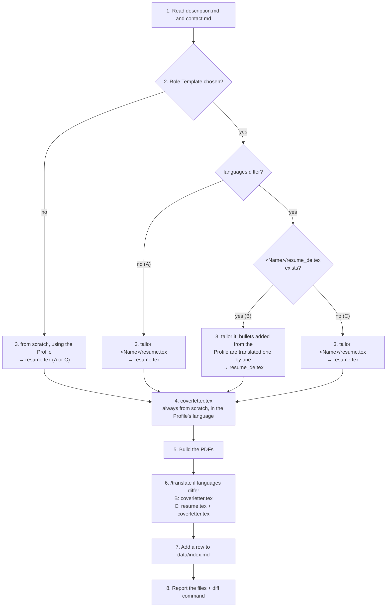

Create tailored `resume.tex` and `coverletter.tex` for a job application, then record it in `data/index.md`.

## Argument

`$ARGUMENTS` is the application directory, e.g. `data/applications/26.04.24_pydev@yousician`. `/review-job` calls this command after confirmation; the user can also call it to resume an interrupted session.

## Data Repo

User data lives in `data/`, a separate git repo that the Tool Repo gitignores, so search it with explicit `data/…` paths: searches from the repo root skip it. If `data/` doesn't exist, stop and tell the user: "no data/ found; run ./setup.sh first". Don't create it.

## Overview

The steps below are authoritative; this diagram is a map of them. `de` stands for the posting's language code.



## Steps

1. **Read** `$ARGUMENTS/description.md` and `data/profile/contact.md` (the canonical header details). Skip `description.md` if this session already wrote or read it and it hasn't changed since (e.g. `/review-job` just wrote it). Read the rest of the Profile only as the steps below say.

   **Profile reads:** before reading Profile files, run `stat -c '%Y %n' data/profile/*.md data/profile/projects/*.md` and keep the output. If this session already read a file (e.g. in `/review-job`), compare against the earlier output and skip it unless its timestamp is newer or you no longer have its text (e.g. after compaction).

2. **Choose the case** from the `**Role Template:**` and `**Posting language:**` lines in the fit analysis. If they're missing (an older `description.md`), recommend a Role Template as `/review-job` does, add both lines, and ask the user to confirm. If the named Role Template isn't in `data/templates/`, list the ones that are and ask.

   Source language = the Profile's; target = the posting's; `<code>` = the target's code from the table in `.claude/commands/translate.md`.

   | Case | When | Resume | Output |
   |------|------|--------|--------|
   | **A** | same language | tailor `data/templates/<Name>/resume.tex`, or from scratch | `resume.tex`, `coverletter.tex` |
   | **B** | languages differ, Role Template has `resume_<code>.tex` | tailor `data/templates/<Name>/resume_<code>.tex`; no source-language resume | `resume_<code>.tex`, `coverletter.tex`, `coverletter_<code>.tex` |
   | **C** | languages differ, no Role Template in the target language | tailor `data/templates/<Name>/resume.tex`, or from scratch; then translate | `resume.tex`, `resume_<code>.tex`, `coverletter.tex`, `coverletter_<code>.tex` |

3. **Write the resume** in `$ARGUMENTS/` (`resume.tex`, or `resume_<code>.tex` in case B).

   **From a Role Template:** copy the Role Template's file, then tailor it:
   - Reorder experience, projects and bullets so the top 3–5 requirements come first; remove what's irrelevant or over the page count.
   - For requirements the Role Template doesn't cover, search the Profile (`grep -ril '<keyword>' data/profile/`) and read only the matching files. Add bullets in the Role Template's style. In case B, write them in the source language and translate them following `/translate` in text mode (`.claude/commands/translate.md`).
   - **Never reword a bullet already in the Role Template**, not even for a typo or a keyword. Its wording is reviewed, and unchanged bullets keep the diff against the Role Template small. If one looks wrong, tell the user to fix it in the Role Template.
   - Check `\resumeheader[...]` against `contact.md`, which wins.

   **From scratch:** read `data/profile/experience.md`, `certificates.md` and all of `projects/`. Start from `src/scaffold/application/resume.tex`, fill `\resumeheader[...]` from `contact.md`, and emphasise the top 3–5 requirements in the most relevant experience entries.

   **Both:**
   - Rewrite `\objective{}` to name the role and the company.
   - Use only achievements from the Profile; don't invent or embellish.
   - `qrcode=../../profile/images/qr_code.png` (Applications and Role Templates are both one level below `data/<folder>/`).
   - Write `$\sim$` for "approximately", never `\~` (an accent command that breaks the build).

4. **Write `$ARGUMENTS/coverletter.tex`**, always from scratch and in the source language. Start from `src/scaffold/application/coverletter.tex` and fill `\coverletterheader[...]` from `contact.md`. Three paragraphs:
   - **Hook:** why this role at this company, citing something concrete from the posting.
   - **Evidence:** 2–3 quantified achievements that address the top requirements. Take them from the resume and the fit analysis' Strengths; look up the Profile only if those aren't enough.
   - **Close:** enthusiasm, an invitation to next steps, a professional sign-off.

5. **Build the PDFs** from the repo root, the resume from step 3 (`resume.tex`, or `resume_<code>.tex` in case B) and the cover letter:
   ```bash
   (cd $ARGUMENTS && latexmk -pdf -r ../../../.latexmkrc <resume>.tex)
   (cd $ARGUMENTS && latexmk -pdf -r ../../../.latexmkrc coverletter.tex)
   ```
   The subshell keeps the working directory at the repo root. `../../../.latexmkrc` is the Tool Repo's rc file; don't use `git rev-parse --show-toplevel`, which resolves to `data/`. If a build fails, show the full error and the manual build command.

6. **Translate** (cases B and C) following `/translate` in file mode with the target language: `coverletter.tex`, and in case C also `resume.tex`. It writes and builds the `_<code>` files and flags page growth. Keep both versions.

7. **Prepend a row to `data/index.md`,** directly below the header separator (`|------|…`), newest first. Date from the directory name (`YY.MM.DD` → `20YY-MM-DD`); the company and full job title as written in the posting (`Octopus Energy`, `Python Developer`), not the slugs. Skip if a row for this folder exists.
   ```
   | YYYY-MM-DD | <Company> | <Role> | [<dir>](applications/<dir>/) |
   ```

8. **Report** every file created, e.g. for case C:
   ```
   Created from the MLOps Role Template:
   - $ARGUMENTS/resume.tex  →  $ARGUMENTS/resume.pdf
   - $ARGUMENTS/resume_de.tex  →  $ARGUMENTS/resume_de.pdf
   - $ARGUMENTS/coverletter.tex  →  $ARGUMENTS/coverletter.pdf
   - $ARGUMENTS/coverletter_de.tex  →  $ARGUMENTS/coverletter_de.pdf
   - Row added to data/index.md

   Review what changed from the Role Template:
     diff data/templates/MLOps/resume.tex $ARGUMENTS/resume.tex
   ```
   The diff compares the file copied in step 3 with the resume written from it; in case B that's `resume_<code>.tex` on both sides. For a from-scratch resume, write "Created from scratch:" and leave out the diff.
