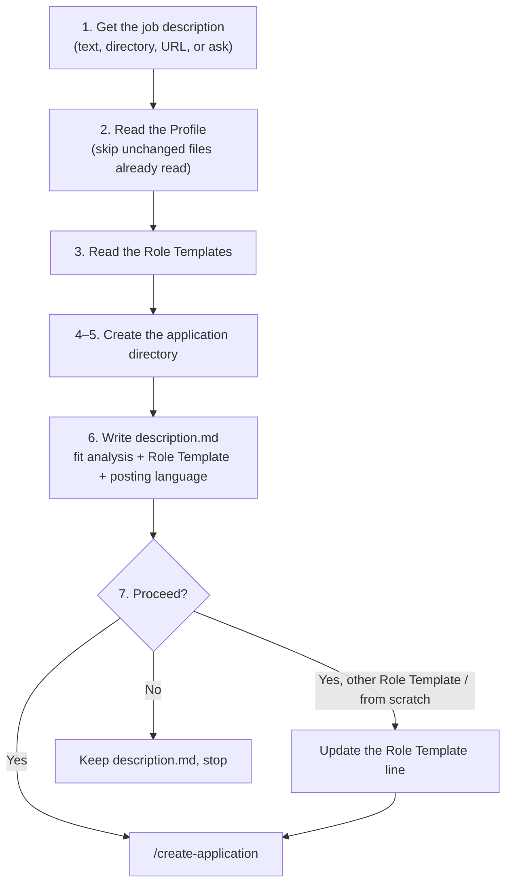

Analyse a job description against the user's profile, write a fit analysis, and optionally create tailored application files.

## Overview

The steps below are authoritative; this diagram is a map of them.



## Invocation modes

`$ARGUMENTS` determines the mode:

- **URL** (starts with `http`): fetch it with WebFetch and extract the job description. If it needs a login (e.g. LinkedIn), ask the user to paste the description instead.
- **Directory path** (e.g. `data/applications/26.04.24_pydev@yousician`): use the `description.md` in it.
- **No argument:** ask the user to paste the job description as the next message.
- **Anything else:** the argument is the job description.

## Data Repo

User data lives in `data/`, a separate git repo that the Tool Repo gitignores, so search it with explicit `data/…` paths: searches from the repo root skip it. If `data/` doesn't exist, stop and tell the user: "no data/ found; run ./setup.sh first". Don't create it.

## Steps

1. **Get the job description** by the mode above.

2. **Read the Profile:** `data/profile/experience.md`, `data/profile/certificates.md`, and all files in `data/profile/projects/`. First run `stat -c '%Y %n' data/profile/*.md data/profile/projects/*.md` and keep the output. If this session already read the Profile, compare against the earlier output and read only files that are new or have a newer timestamp; re-read any file whose text you no longer have (e.g. after compaction).

   The Profile's language is the language of `experience.md`; the posting's language is the language of the job description.

3. **Read the Role Templates:** each directory `data/templates/<Name>/` is one, named after the directory. `resume.tex` is in the Profile's language; other languages have a suffix (`resume_de.tex`). Note each Role Template's job family and languages. None may exist.

4. **Choose the application directory:** the given path in directory mode; otherwise `data/applications/YY.MM.DD_<role>@<company>/` with today's date, a short lowercase `<role>` slug (`pydev`, `mleng`) and the company name in lowercase without spaces (`octopusenergy`). Don't ask the user to confirm it. For a recruiter with an unnamed client, use the recruiter and note the likely client in `description.md`.

5. **Create the directory** if it doesn't exist.

6. **Write `description.md`:**
   ```
   # Job Description

   <raw job description, preserved as-is>

   ## Fit Analysis

   ### Strengths

   | Requirement | Match from Profile |
   |-------------|-------------------|
   | ...         | ...               |

   ### Gaps

   | Requirement | Gap | Severity |
   |-------------|-----|----------|
   | ...         | ... | Low / Medium / High |

   ### Framing Recommendation

   <2–3 sentences on how to position this application>

   - **Role Template:** <Name> (<reason>) | none: from-scratch (<reason>)
   - **Posting language:** <language> (Profile: <language>)

   ## Verdict

   <One sentence: recommend applying or not, and why>
   ```
   Recommend the Role Template whose job family is closest to the posting, e.g. `MLOps (deployment and monitoring are the core of the role)`. A from-scratch resume beats a stretched match: if none is close, or none exist, write `none: from-scratch` with the reason. If the languages differ, say whether the Role Template exists in the posting's language, e.g. `MLOps (…; has resume_de.tex)`.

7. **End with this prompt:**
   ```
   Proceed with creating a tailored CV and cover letter?
   - Yes  → I will create the application files now, <starting from the <Name> Role Template | written from scratch>
   - Yes, but from <another Role Template> or from scratch → I will record your choice and create the files
   - No   → I will save description.md and close
   - Or ask me anything about the analysis
   ```
   - **Yes:** run `/create-application <directory>` inline.
   - **Another Role Template or from scratch:** if the named Role Template doesn't exist, list the ones that do. Replace the `**Role Template:**` line with the choice plus `(chosen by the user)`, then run `/create-application <directory>` inline.
   - **No:** confirm that `description.md` is saved. Don't offer to delete the directory.
