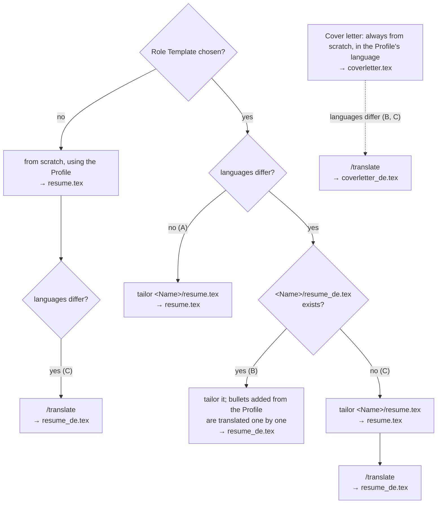

# Resumes start from a Role Template and are tailored within fixed limits

An Application's resume is copied from the user's closest Role Template, then tailored. A Role Template in the job posting's language is used directly; otherwise the one in the Profile's language is used and the tailored resume is translated. The objective is always rewritten, and bullets may be reordered, removed, or added from the Profile, but **bullets already in the Role Template are never reworded**. Without a matching Role Template, the resume is written from scratch, using the Profile. This fixes the two real costs of writing every resume from scratch: reviewed wording drifting between Applications, and re-proofreading a resume that is 85–90% identical to the last one. With the no-rewording rule, a diff against the Role Template shows exactly what needs review.

## Considered Options

- **From scratch every time** (the previous model): rejected. It loses polished wording and hand-tuned layout, and every resume needs a full review.
- **Role Template only, with just the objective changed**: rejected. It can't cover a requirement that the Role Template doesn't.
- **Bullet library in the Profile, every resume assembled from it**: rejected. It means restructuring the Profile and doesn't keep hand-tuned layout.

## Consequences

- The Profile is the source for facts, and each Role Template is the source for its own bullets' wording. They can drift apart. Keeping them in sync is the user's job, and no command checks it. A check would compare the whole Profile against the Role Template on every Application, which costs tokens and context, and would warn about entries the user left out on purpose.
- Resumes and cover letters are written in the Profile's language and, when the posting's language differs, translated by `/translate` in a separate pass, keeping both versions. The exception is a Role Template that already exists in the posting's language: the resume is tailored from it directly, with no Profile-language resume, and bullets added from the Profile are translated as they're inserted. Cover letters are always written from scratch.

## Workflow by language

Example: English Profile, German posting. The Role Template is chosen first, by job family (`/review-job`); only then does its language matter. A, B and C are the cases `/create-application` names: same language, Role Template in the posting's language, and translated afterwards.

Tailoring always means: rewrite the objective; reorder, remove, or add bullets from the Profile; never reword bullets already in the Role Template.

Decided in https://github.com/raadon96/expressive-resume-ai/issues/4.
