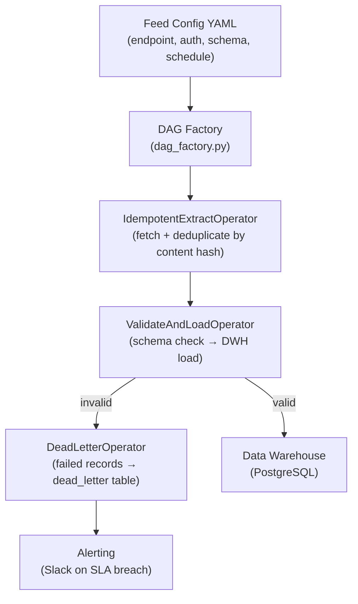

# Interview Prep: DataFlow Pipeline

## Summary

An Apache Airflow-based ETL orchestration framework built at DataStream GmbH for
ingesting 12 third-party data feeds into a unified analytics platform. Emphasises
idempotency, structured error handling, and dead-letter routing.

---

## Context & Pain Points

**Domain:** DataStream's analytics platform aggregated data from 12 third-party
APIs (CRM, ERP, ad networks, logistics providers) into a single data warehouse
for customer dashboards.

**Why this was a problem:**
- **For the data team:** each feed had been integrated ad hoc; no consistent error
  handling, retry logic, or observability — a feed failure would silently produce
  stale dashboard data
- **For customers:** stale dashboards eroded trust; "my data is wrong" was the top
  support ticket category
- **For engineering:** pipeline failures required manual intervention — on average
  2–3 hours/week of on-call triage

**The solution:** A reusable Airflow DAG template and shared operator library that
enforced idempotency, structured alerting, and dead-letter routing across all 12
feed integrations.

---

## How It Works — Spoken Narrative

### The problem in one sentence
Each of 12 data feed integrations was a unique snowflake — no shared error
handling, no consistent retry logic, failures silently produced stale data.

### What we built
- A reusable Airflow DAG factory: parametrised by feed config (endpoint, auth,
  schema, schedule)
- Shared operator library: `IdempotentExtractOperator`, `ValidateAndLoadOperator`,
  `DeadLetterOperator`
- Dead-letter routing: records that fail schema validation go to a dead-letter
  table; alerting fires; data team reviews and reprocesses or discards
- Structured logging: every DAG run emits JSON log events to a central aggregator;
  SLA breach alerts fire if a feed is >15min late

### Outcome
- Pipeline failure rate down 35% (from ~4 failures/week to ~2.5)
- On-call triage time down from ~3h/week to <30min (structured logs made
  root-cause obvious)
- All 12 feeds migrated over 6 weeks with no customer-visible downtime

---

## Architecture

### Key design decisions
- **Idempotency via content hash:** each extracted record is hashed; duplicate
  re-ingestion is a no-op; this allows safe retries without double-counting
- **DAG factory pattern:** all 12 feeds are defined as YAML configs; no per-feed
  Python code; adding a new feed is a config change, not a code change
- **Dead-letter table:** invalid records are preserved for manual review and
  reprocessing — never silently dropped

---

## Q&A Cheat Sheet

| Question | Answer |
|---|---|
| Why Airflow over a custom scheduler? | Already running Airflow for other workloads; leveraging existing infrastructure was faster than operating a second scheduler |
| How did you handle API rate limits? | Each feed config includes a `rate_limit` field; the extract operator sleeps between pages to stay within limits |
| What is idempotency in this context? | Re-running a DAG for the same time window produces the same result as running it once; achieved by content-hashing records and skipping already-loaded hashes |
| What was the hardest part? | Migrating the existing 12 ad hoc integrations without downtime — ran old and new pipelines in parallel for each feed during cutover, comparing outputs row-by-row before switching |
