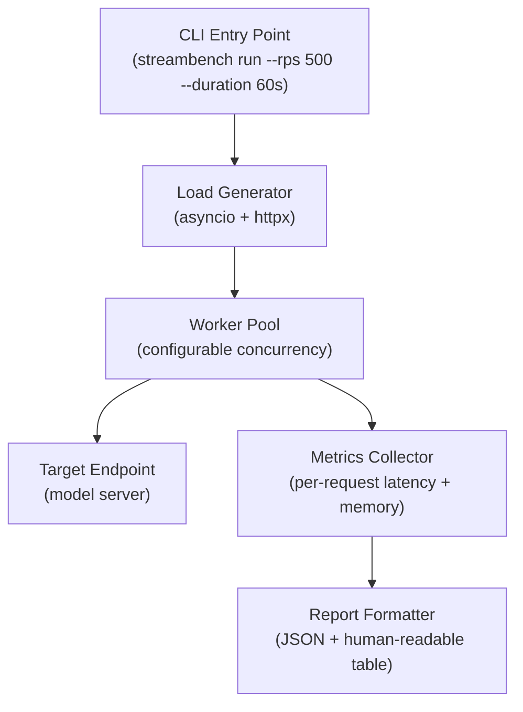

# Interview Prep: StreamBench

## Summary

An open-source Python command-line tool for benchmarking streaming ML inference
pipelines. Measures throughput, p50/p95/p99 latency, and memory consumption under
configurable load profiles. Built internally at Lumino AI and subsequently
open-sourced.

---

## Context & Pain Points

**Domain:** When deploying ML models to production, teams typically benchmark
offline (single-request timing) or rely on load testing tools not designed for
the stateful, batched nature of streaming inference.

**Why this was a problem:**
- **For ML teams:** no standard way to compare two model servers under the same
  load profile; every team ran ad hoc scripts
- **For infrastructure teams:** no reproducible benchmark baseline meant
  performance regressions were discovered in production, not pre-deployment
- **For the org:** three separate teams had each written their own timing harness;
  StreamBench consolidated and open-sourced the pattern

**The solution:** A configurable CLI tool that spins up a synthetic load
generator, fires requests at a target inference endpoint, and reports structured
latency and throughput metrics.

---

## How It Works — Spoken Narrative

### What it does (30 seconds)
- Load testing tool specifically designed for ML inference endpoints
- Configurable: request rate, payload size, concurrency, duration
- Reports p50/p95/p99 latency, throughput (RPS), and peak memory usage
- Designed to be repeatable and CI-friendly — exits non-zero if SLOs are breached

### Architecture
- Async request generator (asyncio + httpx) fires requests at configurable RPS
- Worker pool simulates concurrent clients
- Metrics collector aggregates per-request latency and memory samples
- Report formatter outputs JSON (for CI) and human-readable table (for dev)

### How it was used at Lumino AI
- Run pre-deployment as a gate: any model failing p99 > 100ms at 500 RPS is
  blocked from shipping
- Caught one case where int8 ONNX quantisation increased memory footprint 3×
  even though latency improved — a regression that offline timing would have missed

---

## Architecture

### Key design decisions
- **asyncio over threading:** avoids GIL contention at high RPS; httpx async
  client handles connection pooling
- **HdrHistogram for percentiles:** avoids sort-based percentile errors at high
  request counts; accurate p99 at tail
- **SLO gates:** configurable thresholds (e.g. `--p99-slo 100ms`) cause non-zero
  exit code, enabling CI integration

---

## Q&A Cheat Sheet

| Question | Answer |
|---|---|
| Why build this instead of using Locust or k6? | Those tools are general-purpose HTTP load testers; StreamBench is ML-aware — it understands batching semantics, reports inference-specific metrics, and integrates with model server health check endpoints |
| How did you validate the latency measurements? | Cross-validated against server-side timing logs for a sample of requests; p99 estimates were within 3ms |
| Did you open-source it? | Yes — internal use first, then published once we had a stable API and basic docs |
| What's the biggest limitation? | Single-machine load generator; for endpoints requiring >10k RPS you'd need a distributed load generation setup |
